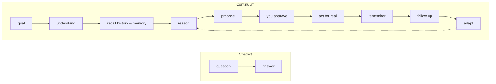
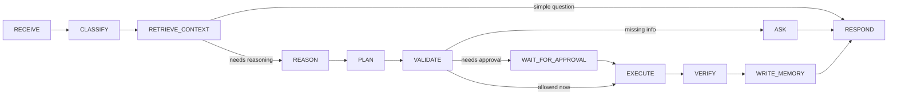

# Continuum

Continuum is a persistent, agentic personal wellbeing and recovery
planning assistant. It is **not** a diagnostic or clinical tool — it never
diagnoses, prescribes, or gives emergency medical advice. It helps with
routines, exercise adherence, scheduling, reminders, progress tracking,
habit formation, and reflection.

Continuum is deliberately not "ChatGPT with a database." It is built to
make the difference between a chatbot and an agent visible:



## Product overview

Tell Continuum "I've been struggling to stay consistent with my exercise
routine," and it will:

1. Retrieve your relevant history and long-term memory.
2. Compare your adherence across session lengths using deterministic
   statistics (not a model guess).
3. Explain what it noticed, citing concrete evidence — never hidden
   chain-of-thought.
4. Propose a concrete plan change and ask for your approval.
5. On approval, actually update your plan (versioned), log an audit
   event, and schedule a follow-up check-in.
6. Later — via a real background job — evaluate your progress and either
   adapt the plan again or decide no intervention is needed.

Every one of those steps is backed by a real, inspectable record: a
plan version, a memory, an audit event, a scheduled check-in. Nothing in
the UI claims something happened that didn't.

## Screenshots

_(Run `npm run dev`, sign in with Demo Mode, and walk through Dashboard →
Agent → Plans → Progress → Memory → Activity to see the app; screenshots
aren't checked into this repo.)_

## Tech stack

- **Frontend:** Next.js 16 (App Router), React 19, TypeScript, Tailwind
  CSS v4, `@tanstack/react-query`, `recharts`.
- **Backend:** Next.js Route Handlers (Node.js runtime), deployed as one
  Cloud Run service.
- **AI:** Google Gemini via Genkit (`genkit` + `@genkit-ai/google-genai`),
  structured (Zod-validated) output, a controlled tool registry.
- **Database:** Firestore in production; a local JSON-file store (same
  schema) when running in `DEMO_MODE` or without Firebase credentials.
- **Auth:** Firebase Authentication (Google + email/password), or a
  signed demo session cookie when `DEMO_MODE=true`.
- **Background execution:** a guarded HTTP endpoint intended for Cloud
  Scheduler in production; a dev-only endpoint locally.
- **Testing:** Vitest (unit + integration).

See [`docs/architecture.md`](docs/architecture.md) for diagrams of the
system, the agent's internal lifecycle, memory, the approval workflow,
background execution, and a full request sequence.

## Local setup

```bash
npm install
npm run seed   # populates the demo user "Alex" with realistic history
npm run dev    # http://localhost:3000
```

With no `.env.local` beyond `DEMO_MODE=true` (see `.env.example`), the app
runs completely locally: no Firebase project, no Gemini key. Sign in with
**Continue in Demo Mode** on the login screen.

Other scripts:

```bash
npm run lint        # ESLint
npm run typecheck   # tsc --noEmit
npm test            # Vitest
npm run build       # production build (also type-checks)
```

## Demo mode

`DEMO_MODE=true` changes three things, and three things only:

1. **Auth** — the login screen offers "Continue in Demo Mode," which
   issues a signed session cookie for a fixed user (`demo-user` / "Alex").
   No Firebase project is required.
2. **Storage** — `lib/repositories` uses a local JSON-file store under
   `.demo-data/` instead of Firestore. It mirrors the exact same schema,
   so switching to Firestore later is a configuration change, not a code
   change.
3. **The agent** — `AgentService` uses `DemoAgentProvider`, a
   deterministic rules engine that runs the *same* progress/evidence/
   policy code Gemini's path uses, and returns the same structured
   `AgentDecision` shape. No network calls, no API key, fully
   reproducible.

Run `npm run seed` to populate `.demo-data/demo-user/` with a profile, a
plan with a v1→v2→v3 version history, three semantic memories, and ~3
weeks of session history engineered so 15-minute sessions land near 82%
completion and 30-minute sessions near 39% — real evidence for the agent
to cite, not fabricated round numbers. Re-running the seed script clears
and rebuilds the demo user's local data directory.

To simulate the background agent without waiting for a schedule:

```bash
curl -X POST http://localhost:3000/api/dev/run-due-checkins \
  -H "Cookie: <your session cookie>"
```

(or click through the Agent tab, approve a plan change, then hit that
endpoint — the seed data includes an already-due check-in.)

## Enabling Gemini

1. Get an API key from [Google AI Studio](https://aistudio.google.com/apikey).
2. Set in `.env.local`:
   ```
   DEMO_MODE=false
   GEMINI_API_KEY=your-key
   GEMINI_MODEL=gemini-3.5-flash   # a concrete, currently-served model id
   ```
3. `GeminiAgentProvider` (backed by Genkit + `@genkit-ai/google-genai`)
   activates automatically — see `src/ai/genkit.ts` and
   `src/ai/agent/decisionEngine.ts`.

`GEMINI_MODEL` should be a concrete model id (default `gemini-3.5-flash`).
The `gemini-flash-latest` alias routes to the newest preview model and is
frequently overloaded (503); pin a real one and bump it deliberately.

## Enabling Firebase

1. Create a Firebase project and a Web App inside it.
2. Copy the web config into the `NEXT_PUBLIC_FIREBASE_*` variables in
   `.env.local`.
3. Create a service account (Project Settings → Service Accounts →
   Generate new private key) and set `FIREBASE_PROJECT_ID`,
   `FIREBASE_CLIENT_EMAIL`, `FIREBASE_PRIVATE_KEY` (keep the `\n` escapes
   when pasting the key into one line).
4. Enable Firestore (Native mode) and enable the Google + Email/Password
   sign-in providers in Firebase Authentication.
5. Deploy security rules and indexes:
   ```bash
   firebase deploy --only firestore:rules,firestore:indexes
   ```
6. Set `DEMO_MODE=false`. The repository layer automatically switches to
   Firestore (`lib/repositories/index.ts`) once Admin credentials are
   present.

## Testing

```bash
npm test
```

Covers (see `tests/unit` and `tests/integration`):

- **Memory** — retrieval ranking/capping, type filtering, expiry,
  deletion, usage tracking, "forget everything."
- **Policy** — safe actions auto-allowed, consequential actions always
  requiring approval regardless of autonomy level, prohibited actions
  (`HIGH_RISK_HEALTH_ACTION`) always denied.
- **Actions** — immediate execution, approval-gated execution,
  idempotent retries (same `idempotencyKey` never double-executes),
  failure handling (`FAILED` status, no partial state), rejection.
- **The critical agent scenario (§49 of the build spec)** — a user with
  30-minute sessions and historically much better 15-minute adherence,
  saying "I'm struggling to stay consistent," is proposed a plan change
  that requires approval and only takes effect once approved — run
  end-to-end through `DemoAgentProvider`.
- **Background check-ins** — one missed session out of five doesn't
  trigger an intervention; a severe adherence drop does, and schedules a
  follow-up.
- **Auth isolation** — the repository layer never returns or mutates
  another user's data.

## Deployment

Two supported targets. Both use the same Firestore + Firebase Auth setup
(Firestore free tier — no GCP billing needed for the database itself; run
`gcloud firestore databases create --location=<region>` then
`firebase deploy --only firestore:rules,firestore:indexes`, and enable
**Google** + **Email/Password** providers in Firebase Auth).

### Deploy to Vercel (no GCP billing)

Next.js runs natively; `firebase-admin`, Firestore and Firebase Auth work
unchanged. The background job runs as a **Vercel Cron** hitting
`GET /api/cron/run-due-checkins` (secured by the `CRON_SECRET` env var,
which Vercel sends as `Authorization: Bearer`). On the Hobby plan cron is
limited to **once per day** — `vercel.json` schedules it at 08:00 UTC.

```bash
npx vercel login
npx vercel link            # create/link the project
npm run vercel:env         # scripts/vercel-env.sh — pushes .env / .env.local to Vercel
npx vercel --prod
```

Then add `<your-project>.vercel.app` to Firebase Auth → **Authorized
domains**, and `curl https://<your-project>.vercel.app/api/health`.

### Deploy to Cloud Run

Prerequisites: `gcloud` authenticated, **billing enabled** on the project,
Firestore created (`gcloud firestore databases create --location=<region>`),
`firebase deploy --only firestore:rules,firestore:indexes` run, and:

```bash
gcloud services enable run.googleapis.com cloudbuild.googleapis.com \
  artifactregistry.googleapis.com secretmanager.googleapis.com \
  cloudscheduler.googleapis.com firestore.googleapis.com identitytoolkit.googleapis.com
```

Then, with all values filled into `.env` / `.env.local` (including real
`SESSION_SECRET` / `CRON_SECRET` — `openssl rand -base64 32`):

```bash
npm run deploy   # scripts/deploy.sh — see below
```

`scripts/deploy.sh` creates the Artifact Registry repo, syncs the
`gemini-api-key` / `firebase-private-key` secrets from your env and grants
the runtime service account access, builds + pushes the image via Cloud
Build, and deploys the Cloud Run service. It then prints the follow-up
steps (add the service host to Firebase **Authorized domains**; run
`npm run setup:scheduler`).

**Why a build step for the client config:** Next.js inlines
`NEXT_PUBLIC_FIREBASE_*` into the browser bundle at build time, so those
six values (the public Firebase Web App config — not secrets) are passed
as Docker `--build-arg`s via `cloudbuild.yaml`. Passing them only to
`gcloud run deploy` is too late and Google/email sign-in never
initializes. Everything server-side (`DEMO_MODE`, Firebase Admin, Gemini,
`SESSION_SECRET`, `CRON_SECRET`) is read from the Cloud Run runtime env.

Doing it by hand instead of the script:

```bash
gcloud artifacts repositories create continuum --repository-format=docker --location=<region>

gcloud builds submit --config cloudbuild.yaml --substitutions \
_IMAGE=<region>-docker.pkg.dev/<PROJECT_ID>/continuum/continuum:latest,\
_NEXT_PUBLIC_FIREBASE_API_KEY=...,_NEXT_PUBLIC_FIREBASE_AUTH_DOMAIN=...,\
_NEXT_PUBLIC_FIREBASE_PROJECT_ID=...,_NEXT_PUBLIC_FIREBASE_STORAGE_BUCKET=...,\
_NEXT_PUBLIC_FIREBASE_MESSAGING_SENDER_ID=...,_NEXT_PUBLIC_FIREBASE_APP_ID=...

gcloud run deploy continuum \
  --image <region>-docker.pkg.dev/<PROJECT_ID>/continuum/continuum:latest \
  --region <region> --allow-unauthenticated \
  --set-env-vars DEMO_MODE=false,GEMINI_MODEL=gemini-3.5-flash \
  --set-env-vars FIREBASE_PROJECT_ID=...,FIREBASE_CLIENT_EMAIL=... \
  --set-env-vars SESSION_SECRET=...,CRON_SECRET=... \
  --set-secrets GEMINI_API_KEY=gemini-api-key:latest,FIREBASE_PRIVATE_KEY=firebase-private-key:latest
```

The `Dockerfile` is a multi-stage build producing Next.js's `standalone`
output, running as a non-root user, listening on `$PORT` (Cloud Run sets
this), with a `HEALTHCHECK` against `GET /api/health`.

### Background check-ins in production

Once the Cloud Run service is deployed with a `CRON_SECRET` set, provision
the Cloud Scheduler job that drives it with:

```bash
npm run setup:scheduler -- --secret=<CRON_SECRET>
```

This runs `scripts/setup-cloud-scheduler.sh`, which creates (or updates,
idempotently) an HTTP job that POSTs to
`<service-url>/api/cron/run-due-checkins` with header
`X-Cron-Secret: <CRON_SECRET>` on an hourly schedule by default. It
resolves the Cloud Run service URL for you, so it only needs the secret;
everything else is optional:

| Flag | Default |
|---|---|
| `--project=<id>` | current `gcloud config` project |
| `--region=<region>` | `us-central1` |
| `--service=<name>` | `continuum` |
| `--url=<url>` | looked up from `--service`/`--region` |
| `--schedule=<cron>` | `0 * * * *` (hourly) |
| `--job-name=<name>` | `continuum-run-due-checkins` |

`--secret` (or the `CRON_SECRET` env var) is the only required value, and
it **must match** the `CRON_SECRET` env var already set on the Cloud Run
service — otherwise every scheduled call gets a 401 from the route.
Run `npm run setup:scheduler -- --help` for the full list, or
`gcloud scheduler jobs run continuum-run-due-checkins --location us-central1`
to trigger it immediately rather than waiting for the schedule.

Prefer to see the raw command instead of running a script? It's exactly:

```bash
gcloud scheduler jobs create http continuum-run-due-checkins \
  --schedule="0 * * * *" \
  --uri="https://<your-service>/api/cron/run-due-checkins" \
  --http-method=POST \
  --headers="X-Cron-Secret=<CRON_SECRET>" \
  --time-zone=UTC
```

No Cloud Tasks/Pub-Sub queue is required for this workload — one HTTP
call evaluates every user's due check-ins per invocation, which is enough
for the demo scale this app targets. See §72/§23 in the build spec for
why heavier infrastructure was intentionally not introduced.

## Security model

- **Identity** comes only from a verified session (`lib/auth/session.ts`)
  — a Firebase session cookie in production, or a signed demo token when
  `DEMO_MODE=true`. No API route ever trusts a client-supplied `userId`.
- **Firestore access** happens only from the server via the Admin SDK,
  which bypasses security rules — so `firestore.rules` simply denies all
  direct client reads/writes. There is no client-side Firestore data path
  to lock down piecemeal.
- **Tool execution is gated, not model-driven.** Gemini (or the demo
  provider) proposes *one* structured action at most; `policyEngine.ts`
  is the sole authority on whether it's allowed and whether it needs
  approval — the model's own `requiresApproval` field is advisory only.
  `HIGH_RISK_HEALTH_ACTION` is unconditionally prohibited.
- **Idempotency** — every `AgentAction` carries an `idempotencyKey`;
  `toolExecutor.ts` looks up a prior completed action with the same key
  before doing anything, so retries can't double-execute.
- **Safety boundary** — a deterministic keyword guard
  (`src/ai/agent/prompts.ts`) intercepts clearly urgent/self-harm
  language before it ever reaches the model, returning a fixed
  safety-resources message.
- Secrets (`GEMINI_API_KEY`, `FIREBASE_PRIVATE_KEY`, `SESSION_SECRET`,
  `CRON_SECRET`) are read only from server-side env vars, never bundled
  to the client.

## Data model

Firestore-shaped collections under `users/{uid}` (mirrored 1:1 by the
local JSON store): `memories`, `plans`, `planVersions`, `events` (doubles
as both the behavioral log the progress engine reads and the audit trail
the Activity page renders), `agentRuns`, `actions`, `checkins`,
`conversations/{id}/messages`. See `lib/types.ts` for the full shape of
every entity and `lib/repositories/types.ts` for the repository
interfaces both backends implement identically.

## Agent lifecycle



See `docs/architecture.md` for the full diagram set (it is all Mermaid)
and `lib/agent/agentService.ts` for the implementation. Classification is
a deterministic keyword check
(`src/ai/agent/planner.ts`), not a second model call — Gemini is called at
most once per user message (`src/ai/agent/decisionEngine.ts`), with a
single structured (`AgentDecisionSchema`) response covering intent,
evidence references, an optional proposed action, and any memory
candidates.

## Limitations

- **No live Gemini or Firebase project is reachable in this build/test
  environment.** `GeminiAgentProvider`, the Firestore repositories, and
  Firebase Auth are fully implemented (not stubbed) but were only
  exercised via `DemoAgentProvider` and the local JSON store here — wire
  up real credentials (see above) to exercise them live.
- **No browser automation was available while building this**, so the UI
  was verified via TypeScript/build correctness, ESLint, the automated
  test suite, and a manual API-level walkthrough of the full demo
  scenario rather than click-through screenshots.
- **Cloud Scheduler/Cloud Tasks are not actually provisioned** — there is
  a working, guarded HTTP endpoint (`/api/cron/run-due-checkins`) for
  Scheduler to call, and a local equivalent for development, but no GCP
  project was attached to provision the schedule itself.
- The proposal card in the Agent chat supports **Approve** and **Reject**
  but not an inline **Edit** of the proposed values before approving —
  the underlying edit-and-resubmit flow wasn't built out for this pass.

## Future improvements

Agent run replay, memory confidence visualization, plan comparison view,
a dedicated "why did you recommend this?" panel beyond the inline
evidence list, a simulation/time-travel mode for demos, richer activity
filtering, dark-mode toggle (currently follows OS preference only), and
keyboard shortcuts (§67 of the build spec) were left out to keep the P0/P1
scope solid rather than spreading thin across polish items.
