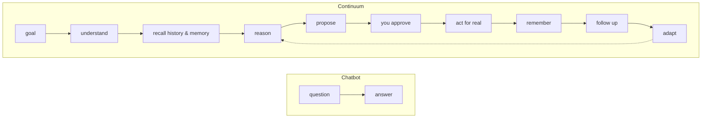
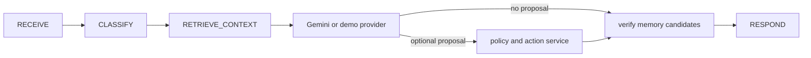

# Continuum

**Live:** https://continuum.himanishpuri.dev (Firebase sign-in, or nothing
to install — see [Local setup](#local-setup) for the credential-free demo).

Continuum is a persistent, agentic personal wellbeing and recovery
planning assistant. It is **not** a diagnostic or clinical tool — it never
diagnoses, prescribes, or gives emergency medical advice. It helps with
routines, exercise adherence, scheduling, reminders, progress tracking,
habit formation, and reflection.

Continuum is deliberately not "ChatGPT with a database." It is built to
make the difference between a chatbot and an agent visible:


```mermaid
flowchart LR
    subgraph Chatbot
        direction LR
        q[question] --> a[answer]
    end
    subgraph Continuum
        direction LR
        g[goal] --> u[understand] --> mem["recall history & memory"] --> rs[reason]
        rs --> pr[propose] --> ok[you approve] --> act[act for real]
        act --> wm[remember] --> fu[follow up] --> ad[adapt]
        ad -.-> rs
    end
```

## Product overview

Tell Continuum "I've been struggling to stay consistent with my exercise
routine," and it will:

1. Retrieve your relevant history and long-term memory.
2. Compare your adherence across session lengths using deterministic
   statistics (not a model guess).
3. Explain what it noticed, citing concrete evidence — never hidden
   chain-of-thought.
4. Propose a concrete plan change and ask for your approval.
5. On approval, actually update your plan (versioned), log an audit
   event, and schedule a follow-up check-in.
6. Later, a scheduled job evaluates your progress, asks whether the
   schedule still works after a severe drop, or records that no change is needed.
   With reminders enabled and Web Push configured, it sends the result to
   registered devices. You can answer with a 0–10 confidence rating and note.

Plans keep their full version history. You can restore an earlier version
from the Plans page; the restore creates a new version attributed to you.
Agent-suggested memories wait on the Memory page for your review before
they enter the agent's context. Activity includes per-user agent insights.

Every one of those steps is backed by a real, inspectable record: a
plan version, a memory, an audit event, a scheduled check-in. Nothing in
the UI claims something happened that didn't. If the model's reply
describes a pending proposal as already done, Continuum appends "Nothing
has changed yet — approve it below to apply." and flags the run.

## Tech stack

- **Frontend:** Next.js 16 (App Router), React 19, TypeScript, Tailwind
  CSS v4, `@tanstack/react-query`, `recharts`.
- **Backend:** Next.js Route Handlers on Vercel.
- **AI:** Google Gemini via Genkit (`genkit` + `@genkit-ai/google-genai`),
  structured (Zod-validated) output, a controlled tool registry.
- **Database:** Firestore in production; a local JSON-file store (same
  schema) when running in `DEMO_MODE` or without Firebase credentials.
- **Auth:** Firebase Authentication (Google + email/password), or a
  signed demo session cookie when `DEMO_MODE=true`.
- **Background execution:** Vercel Cron calls a guarded GET endpoint daily;
  a demo-only POST endpoint runs check-ins for the signed-in user locally.
- **Testing:** Vitest (unit + integration).
- **Delivery:** Web Push using VAPID keys and a service worker.

See [`docs/architecture.md`](docs/architecture.md) for diagrams of the
system, the agent's internal lifecycle, memory, the approval workflow,
background execution, and a full request sequence.

## Local setup

```bash
bun i          # dependencies are locked in bun.lock
npm run seed   # populates the demo user "Alex" with realistic history
npm run dev    # http://localhost:3000
```

With no `.env.local` beyond `DEMO_MODE=true` (see `.env.example`), the app
runs completely locally: no Firebase project, no Gemini key. Sign in with
**Continue in Demo Mode** on the login screen.

Other scripts:

```bash
npm run lint        # ESLint
npm run typecheck   # tsc --noEmit
npm test            # Vitest
npm run build       # production build (also type-checks)
npm run eval        # live Gemini scenarios and coaching judge; use a separate key
```

## Demo mode

`DEMO_MODE=true` changes three things, and three things only:

1. **Auth** — the login screen offers "Continue in Demo Mode," which
   issues a signed session cookie for a fixed user (`demo-user` / "Alex").
   No Firebase project is required.
2. **Storage** — `lib/repositories` uses a local JSON-file store under
   `.demo-data/` instead of Firestore. It mirrors the exact same schema,
   so switching to Firestore later is a configuration change, not a code
   change.
3. **The agent** — `AgentService` uses `DemoAgentProvider`, a
   deterministic rules engine that runs the *same* progress/evidence/
   policy code Gemini's path uses, and returns the same structured
   `AgentDecision` shape. No network calls, no API key, fully
   reproducible.

Run `npm run seed` to populate `.demo-data/demo-user/` with a profile, a
plan with a v1→v2→v3 version history, three semantic memories, and ~3
weeks of session history engineered so 15-minute sessions land near 82%
completion and 30-minute sessions near 39% — real evidence for the agent
to cite, not fabricated round numbers. Re-running the seed script clears
and rebuilds the demo user's local data directory.

To simulate the background agent without waiting for a schedule:

```bash
curl -X POST http://localhost:3000/api/dev/run-due-checkins \
  -H "Cookie: <your session cookie>"
```

(or click through the Agent tab, approve a plan change, then hit that
endpoint — the seed data includes an already-due check-in.)

## Enabling Gemini

1. Get an API key from [Google AI Studio](https://aistudio.google.com/apikey).
2. Set in `.env.local`:
   ```
   DEMO_MODE=false
   GEMINI_API_KEY=your-key
   GEMINI_MODEL=gemini-3.5-flash   # a concrete, currently-served model id
   ```
3. `GeminiAgentProvider` (backed by Genkit + `@genkit-ai/google-genai`)
   activates automatically — see `src/ai/genkit.ts` and
   `src/ai/agent/decisionEngine.ts`.

`GEMINI_MODEL` should be a concrete model id (default `gemini-3.5-flash`).
The `gemini-flash-latest` alias routes to the newest preview model and is
frequently overloaded (503); pin a real one and bump it deliberately.

The decision call is wrapped with Genkit's `retry` and `fallback`
middleware (`@genkit-ai/middleware`, registered in `src/ai/genkit.ts`):
transient 503/429s are retried with backoff, and if `GEMINI_MODEL` keeps
failing or has been retired (404) it falls back to
`GEMINI_FALLBACK_MODELS` (default `gemini-flash-lite-latest`). Set that
var to an empty string to disable fallback.

## Enabling Firebase

1. Create a Firebase project and a Web App inside it.
2. Copy the web config into the `NEXT_PUBLIC_FIREBASE_*` variables in
   `.env.local`.
3. Create a service account (Project Settings → Service Accounts →
   Generate new private key) and set `FIREBASE_PROJECT_ID`,
   `FIREBASE_CLIENT_EMAIL`, `FIREBASE_PRIVATE_KEY` (keep the `\n` escapes
   when pasting the key into one line).
4. Enable Firestore (Native mode) and enable the Google + Email/Password
   sign-in providers in Firebase Authentication.
5. Deploy security rules and indexes:
   ```bash
   firebase deploy --only firestore:rules,firestore:indexes
   ```
6. Set `DEMO_MODE=false`. The repository layer automatically switches to
   Firestore (`lib/repositories/index.ts`) once Admin credentials are
   present.

## Enabling check-in push notifications

Generate VAPID keys with `npx web-push generate-vapid-keys`. Set
`NEXT_PUBLIC_VAPID_PUBLIC_KEY`, `VAPID_PRIVATE_KEY`, and `VAPID_SUBJECT`
(for example `mailto:you@example.com`) in `.env.local` or Vercel. The
public key is browser-visible; keep the private key server-side. The
`npm run vercel:env` script pushes these variables. In Settings, enable
"Notifications on this device" in each browser you want to receive them.
The separate Reminders preference remains the server-side gate. On iOS,
install the app to the Home Screen first.

## Testing

```bash
npm test
```

Covers (see `tests/unit` and `tests/integration`):

- **Memory** — retrieval ranking/capping, type filtering, expiry,
  deletion, usage tracking, "forget everything."
- **Policy** — safe actions auto-allowed, consequential actions always
  requiring approval regardless of autonomy level, prohibited actions
  (`HIGH_RISK_HEALTH_ACTION`) always denied.
- **Actions** — immediate execution, approval-gated execution,
  idempotent retries (same `idempotencyKey` never double-executes),
  failure handling (`FAILED` status, no partial state), rejection.
- **The critical agent scenario** — a user with 30-minute sessions and
  historically much better 15-minute adherence, saying "I'm struggling to
  stay consistent," is proposed a plan change that requires approval and
  only takes effect once approved — run end-to-end through
  `DemoAgentProvider`.
- **Background check-ins** — one missed session out of five doesn't
  trigger an intervention; a severe adherence drop does, and schedules a
  follow-up. Push tests cover delivery and expired-device pruning.
- **Plan restore and check-in replies** — full snapshots, user attribution,
  retry behavior, ownership checks, and confidence-based smaller steps.
- **Agent metrics** — approval, degradation, safety, latency, token, confidence,
  and 14-day post-change adherence calculations.
- **Safety** — keyword matching across curly apostrophes and paraphrases,
  no false positives on phrases like "killing it at the gym," and the
  model-flagged safety stop.
- **Reply truthfulness** — `claimsCompletedChange` detects replies that
  describe a pending proposal as done, and the agent adds the
  approval reminder.
- **Auth isolation** — the repository layer never returns or mutates
  another user's data.
- **Progress** — session duration rates, streaks, empty logs, and multiple
  sessions on the same day.
- **Security utilities** — timing-safe string comparison, per-key rate
  limiting, and session timestamp bounds.

The separate live suite (`npm run eval`) runs eight Gemini scenarios and
an MITI-inspired coaching judge, writing JSON reports under
`evals/results/`. It skips without a key. Use `EVAL_GEMINI_API_KEY` with a
separate key from the deployed app: a full run makes multiple model and
judge calls and can consume the free tier's daily quota. The suite uses
`.demo-data-eval/` and local storage, regardless of Firebase credentials.

## Deployment

Deploy to Vercel. Create the Firestore database in the Firebase console,
enable **Google** and **Email/Password** providers in Firebase Authentication,
and deploy the rules and indexes with
`firebase deploy --only firestore:rules,firestore:indexes`.

### Deploy to Vercel

Next.js runs natively; `firebase-admin`, Firestore and Firebase Auth work
unchanged. The background job runs as a **Vercel Cron** hitting
`GET /api/cron/run-due-checkins` (secured by the `CRON_SECRET` env var,
which Vercel sends as `Authorization: Bearer <CRON_SECRET>`). `vercel.json`
schedules it daily at 08:00 UTC. Set the public Firebase Web App config
(`NEXT_PUBLIC_FIREBASE_*`) in Vercel before building; Next.js inlines these
values into the browser bundle.

```bash
npx vercel login
npx vercel link            # create/link the project
npm run vercel:env         # scripts/vercel-env.sh — pushes .env / .env.local to Vercel
npx vercel --prod
```

Then add every domain users sign in from (the `vercel.app` domain and any
custom domain, e.g. `continuum.himanishpuri.dev`) to Firebase Auth →
**Authorized domains**, and `curl https://<your-domain>/api/health`.

## Security model

- **Identity** comes only from a verified session (`lib/auth/session.ts`)
  — a Firebase session cookie in production, or a signed demo token when
  `DEMO_MODE=true`. No API route ever trusts a client-supplied `userId`.
- **Firestore access** happens only from the server via the Admin SDK,
  which bypasses security rules — so `firestore.rules` simply denies all
  direct client reads/writes. There is no client-side Firestore data path
  to lock down piecemeal.
- **Tool execution is gated, not model-driven.** Gemini (or the demo
  provider) proposes *one* structured action at most; `policyEngine.ts`
  decides whether agent proposals are allowed and whether they need
  approval — the model's own `requiresApproval` field is advisory only.
  A user-clicked plan restore carries explicit consent through the same
  action ledger.
  `HIGH_RISK_HEALTH_ACTION` is unconditionally prohibited.
- **Idempotency** — every `AgentAction` carries an `idempotencyKey`;
  `toolExecutor.ts` looks up a prior completed action with the same key
  before doing anything, so retries can't double-execute.
- **Action proposals pass through a deterministic gate.** The decision
  engine validates proposed tool parameters, and the policy engine decides
  whether an action is allowed and whether approval is required. Allowed
  low-risk actions can execute without approval.
- **Prompt injection is contained by the gate, not the prompt.** User messages
  and remembered facts enter model context, so a user can make the agent say
  odd things. The deterministic policy engine and Zod validation of tool
  parameters prevent consequential actions unless policy allows them; plan
  changes, external messages, and memory deletion require user approval.
- **Safety boundary** — a deterministic keyword guard
  (`src/ai/agent/prompts.ts`) intercepts clearly urgent/self-harm
  language before it ever reaches the model; a second model-flag layer
  catches urgent paraphrases. Both return the same fixed safety-resources
  message and record a safety stop.
- **Memory review** — agent-inferred memories stay pending and excluded
  from context until you confirm them. Updates to trusted memories need
  approval.
- **Push endpoints** — subscription URLs are restricted to known HTTPS
  push services; expired endpoints are pruned after 404/410 responses.
- Secrets (`GEMINI_API_KEY`, `FIREBASE_PRIVATE_KEY`, `SESSION_SECRET`,
  `CRON_SECRET`, `VAPID_PRIVATE_KEY`) are read only from server-side env vars, never bundled
  to the client. The cron endpoint compares the Bearer value with
  `timingSafeEqualStr`.
- HTTP security headers (`X-Frame-Options`, `X-Content-Type-Options`,
  `Referrer-Policy`, `Permissions-Policy`) are set in `next.config.ts`;
  Vercel adds HSTS. Per-user, per-instance rate limits guard the agent and event
  endpoints (`lib/util/rateLimit.ts`). See [`SECURITY.md`](SECURITY.md).

## Data model

Firestore-shaped collections under `users/{uid}` (mirrored 1:1 by the
local JSON store): `memories`, `plans`, `planVersions`, `events` (doubles
as both the behavioral log the progress engine reads and the audit trail
the Activity page renders), `agentRuns`, `actions`, `checkins`, `pushSubscriptions`,
`conversations/{id}/messages`. See `lib/types.ts` for the full shape of
every entity and `lib/repositories/types.ts` for the repository
interfaces both backends implement identically.

## Agent lifecycle


```mermaid
flowchart LR
    RECEIVE --> CLASSIFY --> RETRIEVE_CONTEXT
    RETRIEVE_CONTEXT --> PROVIDER[Gemini or demo provider]
    PROVIDER -->|optional proposal| POLICY[policy and action service]
    PROVIDER -->|no proposal| MEMORY[verify memory candidates]
    POLICY --> MEMORY --> RESPOND
```

See `docs/architecture.md` for the full diagram set (it is all Mermaid)
and `lib/agent/agentService.ts` for the implementation. Classification is
a deterministic keyword check (`src/ai/agent/planner.ts`). The Gemini
provider uses a structured `AgentDecisionSchema` response; invalid action
parameters can trigger one repair call (`src/ai/agent/decisionEngine.ts`).

## Limitations

- **Gemini requests depend on the configured model's availability and
  quota.** The decision call tries `GEMINI_FALLBACK_MODELS` when the primary
  fails with an eligible error; if all configured models fail, the agent
  asks the user to try again later.
- **The background check-in job runs once per day** (08:00 UTC) as
  scheduled in `vercel.json`.
- **Rate limiting is in-process** (`lib/util/rateLimit.ts`) and does not
  coordinate across Vercel function instances.
- The proposal card in the Agent chat supports **Approve** and **Reject**
  but not an inline **Edit** of the proposed values before approving.

## Future improvements

- A dedicated open-weight safety/intent classifier as a third safety layer.
- Genkit-to-OpenTelemetry export when Blaze/GCP billing is available.
- Wearable signals and just-in-time adaptive intervention (JITAI) timing.
- A post-hoc review tier for small, reversible plan changes under the
  "autonomous" setting.
- Agent run replay, a plan comparison view, and richer activity filtering.
