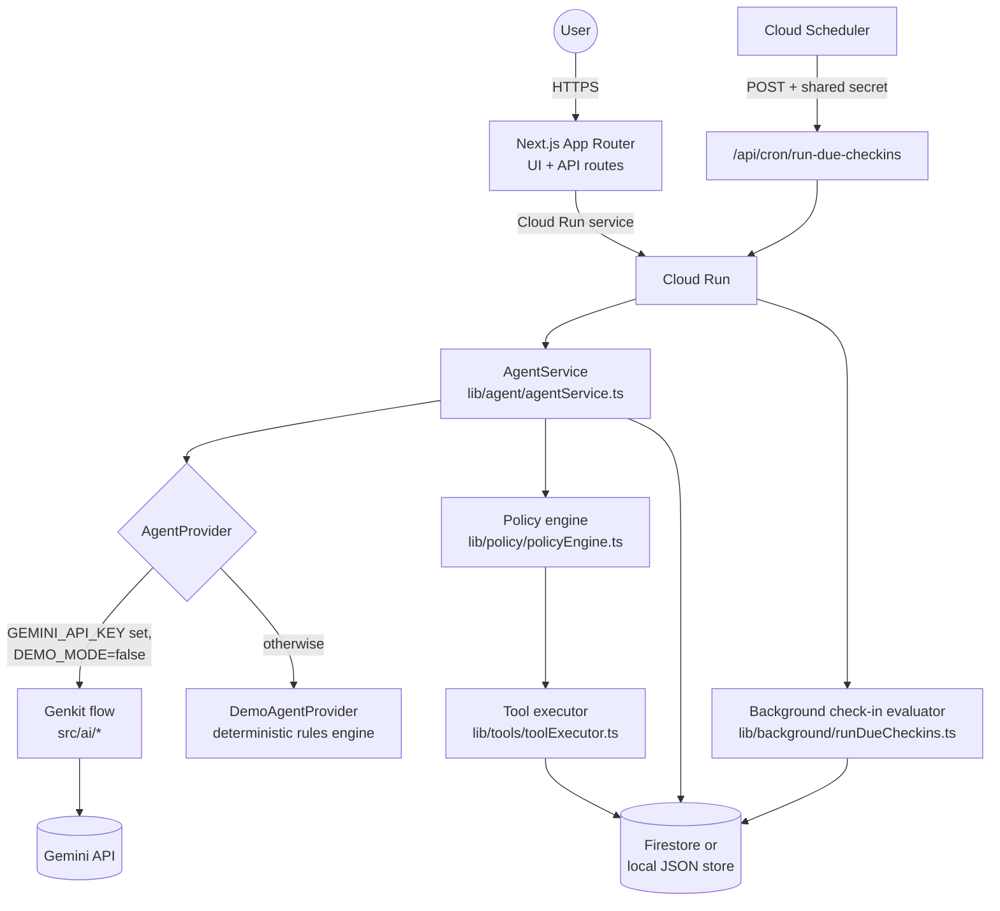
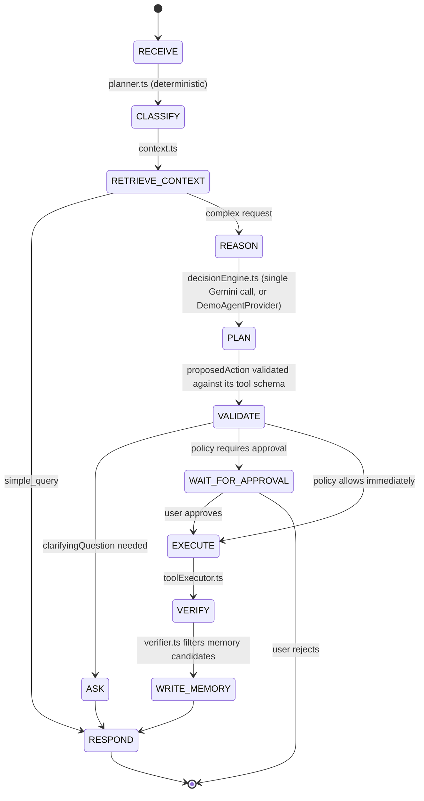
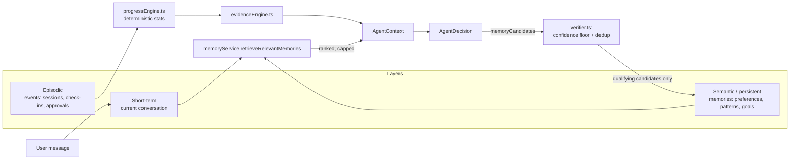
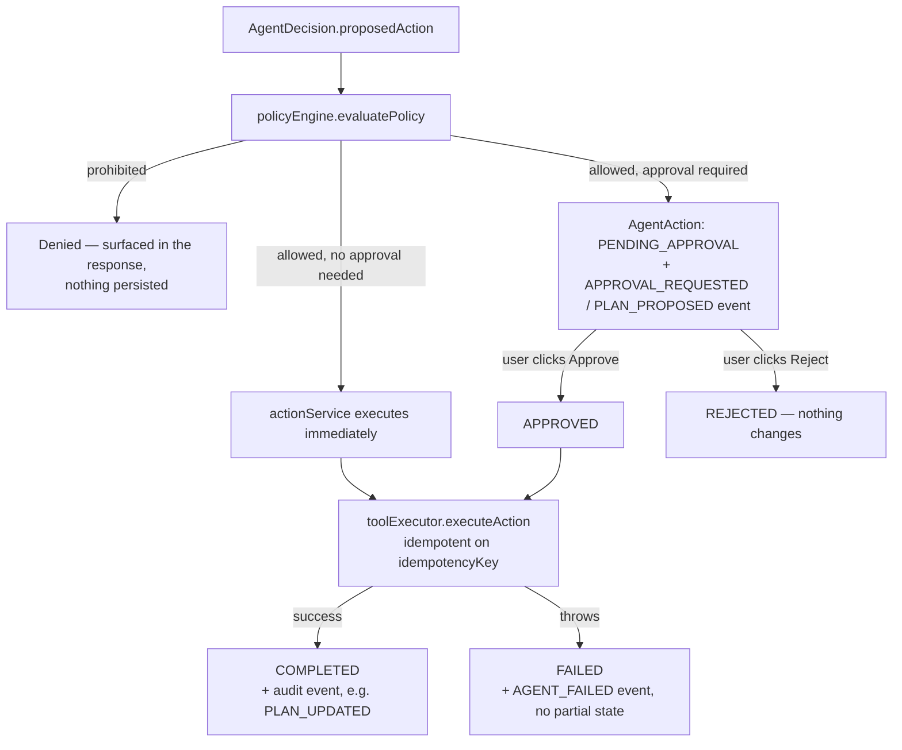
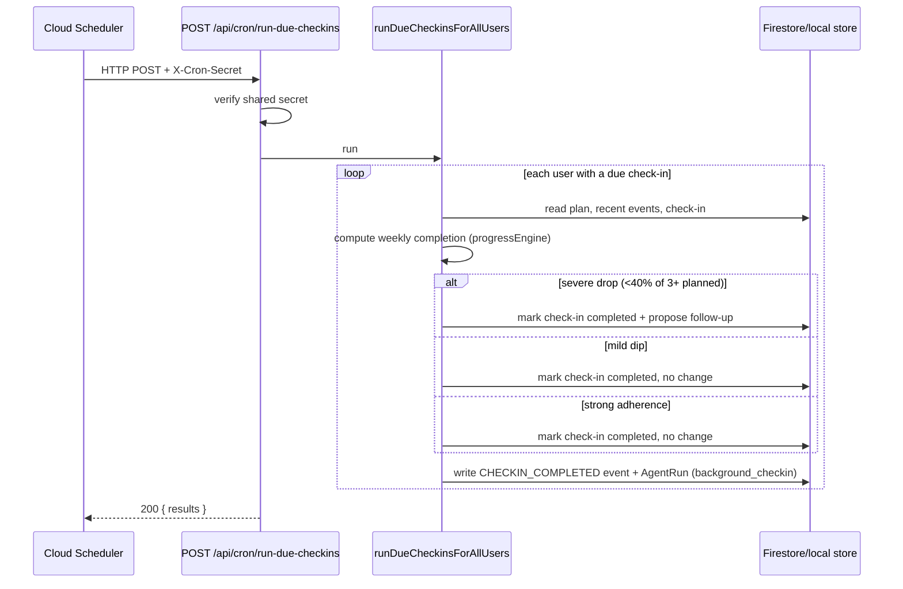
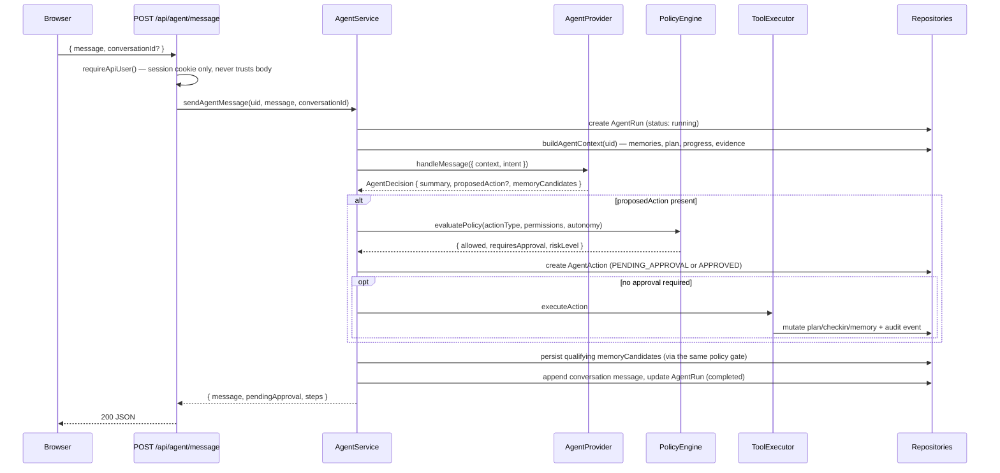

# Continuum — Architecture

This document describes how Continuum is put together: the runtime
architecture, the agent's internal lifecycle, its memory model, the
approval workflow that gates consequential actions, and how background
(check-in) execution works.

## 1. System architecture

Everything runs inside one Cloud Run service. `AgentProvider` is the only
seam between "real Gemini" and "deterministic demo" — every other layer
(policy, execution, storage) is identical regardless of which one is
active, which is what lets `DEMO_MODE=true` exercise the full app with no
external credentials.

## 2. Agent lifecycle

Not every message visits every state — a factual question
("What's my next session?") goes RECEIVE → CLASSIFY → RETRIEVE_CONTEXT →
RESPOND directly. A message like "I can't keep up with my routine" walks
the full path.

## 3. Memory architecture

Memory is never handed to the model unfiltered: `retrieveRelevantMemories`
ranks by a confidence/recency score and caps how much comes back, and only
memory candidates that clear the verifier's confidence and duplicate
checks are ever persisted (§25/§26).

## 4. Approval workflow

The model's own `requiresApproval` guess is never trusted — the policy
engine's decision is authoritative and cannot be overridden by anything
the model returns (§20/§71).

## 5. Background execution

Locally, `POST /api/dev/run-due-checkins` (gated to `DEMO_MODE=true`, scoped
to the signed-in user) calls the exact same `runDueCheckinsForUser`
function the cron route uses — there is no separate "fake" demo path.

## 6. Request sequence — a chat message end to end

