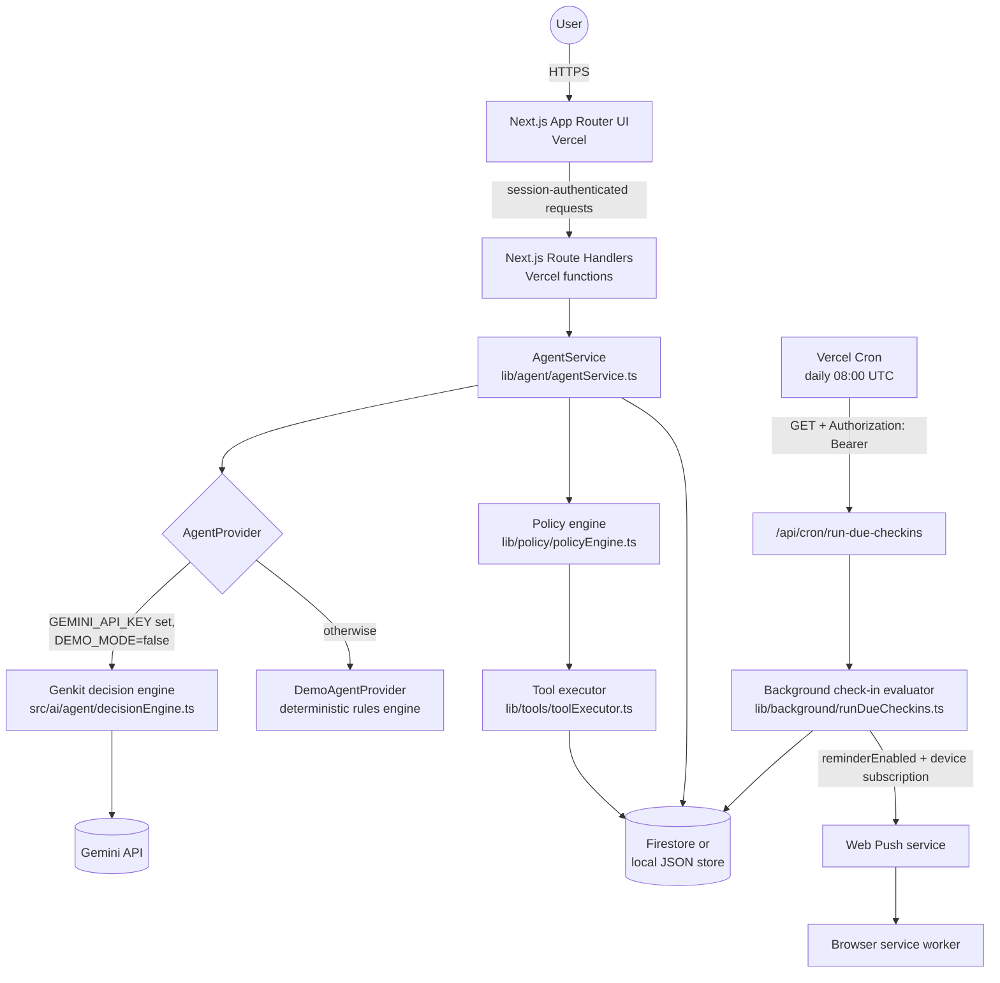
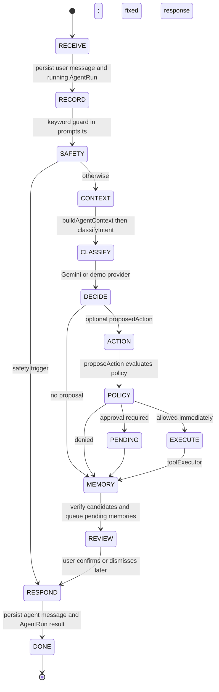
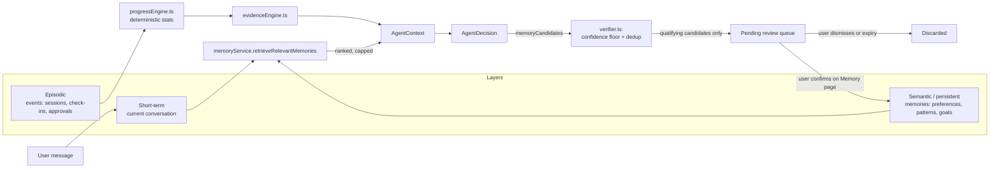
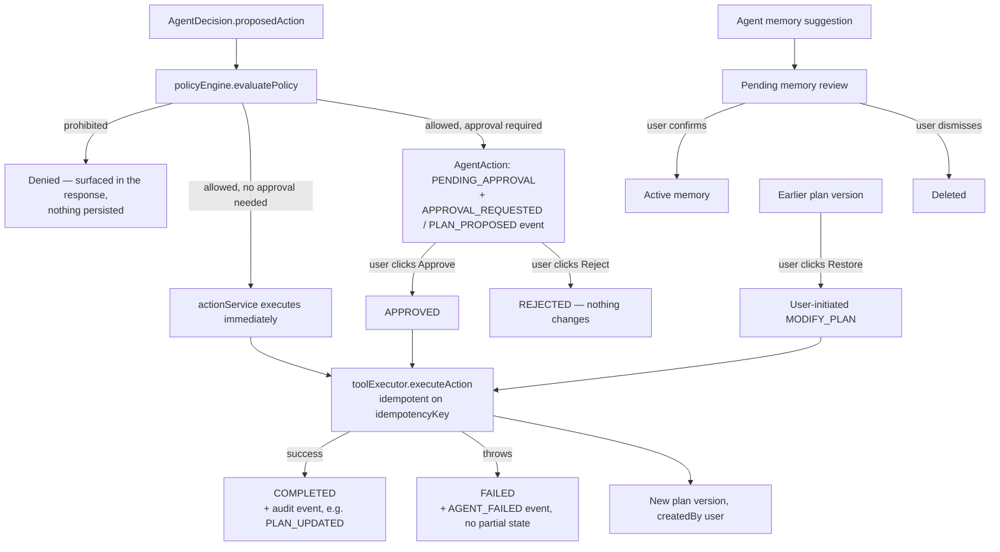
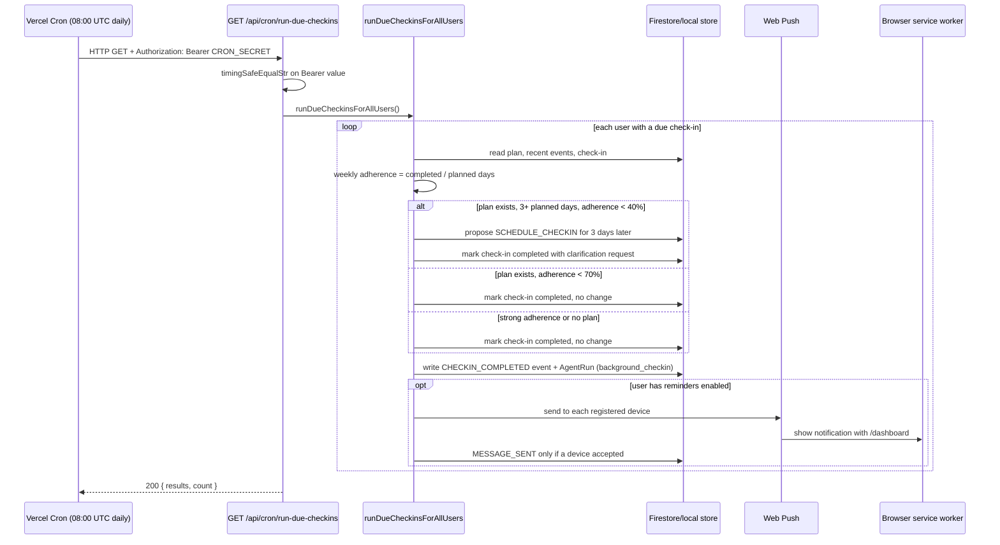
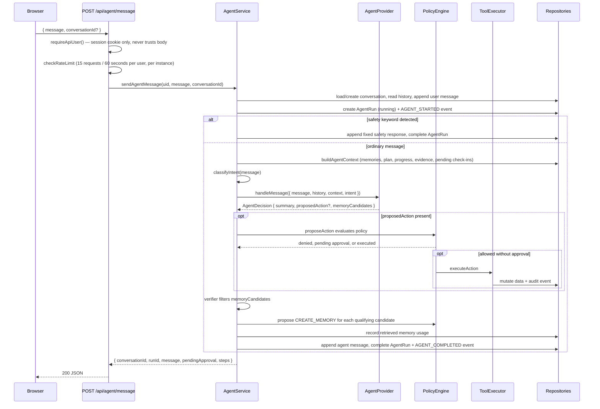

# Continuum — Architecture

This document describes how Continuum is put together: the runtime
architecture, the agent's internal lifecycle, its memory model, the
approval workflow that gates consequential actions, and how background
(check-in) execution works.

## 1. System architecture

```mermaid
flowchart TD
    User((User)) -->|HTTPS| UI[Next.js App Router UI<br/>Vercel]
    UI -->|session-authenticated requests| API[Next.js Route Handlers<br/>Vercel functions]
    API --> AgentService[AgentService<br/>lib/agent/agentService.ts]
    AgentService --> Provider{AgentProvider}
    Provider -->|GEMINI_API_KEY set,<br/>DEMO_MODE=false| Genkit[Genkit decision engine<br/>src/ai/agent/decisionEngine.ts]
    Genkit --> Gemini[(Gemini API)]
    Provider -->|otherwise| Demo[DemoAgentProvider<br/>deterministic rules engine]
    AgentService --> Policy[Policy engine<br/>lib/policy/policyEngine.ts]
    Policy --> Executor[Tool executor<br/>lib/tools/toolExecutor.ts]
    Executor --> Data[(Firestore or<br/>local JSON store)]
    AgentService --> Data
    Cron[Vercel Cron<br/>daily 08:00 UTC] -->|GET + Authorization: Bearer| CronRoute["/api/cron/run-due-checkins"]
    CronRoute --> Background[Background check-in evaluator<br/>lib/background/runDueCheckins.ts]
    Background --> Data
    Background -->|reminderEnabled + device subscription| Push[Web Push service]
    Push --> SW[Browser service worker]
```

The UI and route handlers run on Vercel. `AgentProvider` selects Gemini or
the deterministic demo provider; the policy and execution code is shared.
The repository layer selects Firestore or local JSON storage in demo mode.

## 2. Agent lifecycle

```mermaid
stateDiagram-v2
    [*] --> RECEIVE
    RECEIVE --> RECORD: persist user message and running AgentRun
    RECORD --> SAFETY: keyword guard in prompts.ts
    SAFETY --> RESPOND: safety trigger; fixed response
    SAFETY --> CONTEXT: otherwise
    CONTEXT --> CLASSIFY: buildAgentContext then classifyIntent
    CLASSIFY --> DECIDE: Gemini or demo provider
    DECIDE --> ACTION: optional proposedAction
    DECIDE --> MEMORY: no proposal
    ACTION --> POLICY: proposeAction evaluates policy
    POLICY --> PENDING: approval required
    POLICY --> EXECUTE: allowed immediately
    POLICY --> MEMORY: denied
    PENDING --> MEMORY
    EXECUTE --> MEMORY: toolExecutor
    MEMORY --> REVIEW: verify candidates and queue pending memories
    REVIEW --> RESPOND: user confirms or dismisses later
    RESPOND --> DONE: persist agent message and AgentRun result
    DONE --> [*]
```

The safety branch returns before context retrieval or provider selection.
For every other message, both providers receive the classified intent and
context, including pending check-ins. A simple question still reaches the
provider. The Gemini decision engine makes one structured call and can make
one more call to repair invalid action parameters. Its Genkit middleware
retries transient errors and can fall back to another configured model.
Approval and rejection happen later through the action endpoints.

## 3. Memory architecture

```mermaid
flowchart LR
    subgraph Layers
        ST[Short-term<br/>current conversation]
        EP[Episodic<br/>events: sessions, check-ins, approvals]
        SEM[Semantic / persistent<br/>memories: preferences, patterns, goals]
    end
    Message[User message] --> ST
    ST --> Retrieval[memoryService.retrieveRelevantMemories]
    EP --> ProgressEngine[progressEngine.ts<br/>deterministic stats]
    ProgressEngine --> EvidenceEngine[evidenceEngine.ts]
    SEM --> Retrieval
    Retrieval -->|ranked, capped| Context[AgentContext]
    EvidenceEngine --> Context
    Context --> Decision[AgentDecision]
    Decision -->|memoryCandidates| Verifier[verifier.ts:<br/>confidence floor + dedup]
    Verifier -->|qualifying candidates only| Pending[Pending review queue]
    Pending -->|user confirms on Memory page| SEM
    Pending -->|user dismisses or expiry| Discarded[Discarded]
```

Memory is never handed to the model unfiltered: `retrieveRelevantMemories`
ranks active memories by confidence and recency and caps the result.
Agent-inferred candidates that pass the verifier enter a pending queue;
they are excluded from context until the user confirms them. Pending
suggestions expire after 14 days if left unreviewed. Updates to trusted
memories need approval.

## 4. Approval workflow

```mermaid
flowchart TD
    Decision[AgentDecision.proposedAction] --> Policy[policyEngine.evaluatePolicy]
    Policy -->|prohibited| Denied[Denied — surfaced in the response,<br/>nothing persisted]
    Policy -->|allowed, no approval needed| AutoExec[actionService executes immediately]
    Policy -->|allowed, approval required| Pending[AgentAction: PENDING_APPROVAL<br/>+ APPROVAL_REQUESTED / PLAN_PROPOSED event]
    Pending -->|user clicks Approve| Approved[APPROVED]
    Pending -->|user clicks Reject| Rejected[REJECTED — nothing changes]
    Approved --> Exec[toolExecutor.executeAction<br/>idempotent on idempotencyKey]
    AutoExec --> Exec
    Exec -->|success| Completed[COMPLETED<br/>+ audit event, e.g. PLAN_UPDATED]
    Exec -->|throws| Failed[FAILED<br/>+ AGENT_FAILED event, no partial state]
    PendingMemory[Agent memory suggestion] --> MemoryQueue[Pending memory review]
    MemoryQueue -->|user confirms| ActiveMemory[Active memory]
    MemoryQueue -->|user dismisses| Dismissed[Deleted]
    Version[Earlier plan version] -->|user clicks Restore| Revert[User-initiated MODIFY_PLAN]
    Revert --> Exec
    Exec --> NewVersion[New plan version, createdBy user]
```

The model's own `requiresApproval` guess is never trusted — the policy
engine's decision is authoritative and cannot be overridden by anything
the model returns. A restore click is a separate user-initiated action:
it carries the user's consent, passes through the same idempotent executor,
and bypasses only the agent's autonomy and plan-edit permission settings.
High-risk health actions remain prohibited.

## 5. Background execution

```mermaid
sequenceDiagram
    participant Scheduler as Vercel Cron (08:00 UTC daily)
    participant Cron as GET /api/cron/run-due-checkins
    participant Job as runDueCheckinsForAllUsers
    participant Data as Firestore/local store
    participant Push as Web Push
    participant SW as Browser service worker

    Scheduler->>Cron: HTTP GET + Authorization: Bearer CRON_SECRET
    Cron->>Cron: timingSafeEqualStr on Bearer value
    Cron->>Job: runDueCheckinsForAllUsers()
    loop each user with a due check-in
        Job->>Data: read plan, recent events, check-in
        Job->>Job: weekly adherence = completed / planned days
        alt plan exists, 3+ planned days, adherence < 40%
            Job->>Data: propose SCHEDULE_CHECKIN for 3 days later
            Job->>Data: mark check-in completed with clarification request
        else plan exists, adherence < 70%
            Job->>Data: mark check-in completed, no change
        else strong adherence or no plan
            Job->>Data: mark check-in completed, no change
        end
        Job->>Data: write CHECKIN_COMPLETED event + AgentRun (background_checkin)
        opt user has reminders enabled
            Job->>Push: send to each registered device
            Push->>SW: show notification with /dashboard#checkin
            Job->>Data: MESSAGE_SENT only if a device accepted
        end
    end
    Cron-->>Scheduler: 200 { results, count }
```

Locally, `POST /api/dev/run-due-checkins` (gated to `DEMO_MODE=true`, scoped
to the signed-in user) calls the exact same `runDueCheckinsForUser`
function the cron route uses for each user.
The Dashboard displays the latest completed check-in and accepts one
confidence rating (0–10) plus an optional note. The latest self-report
enters the next agent context; a low rating can bias the demo agent toward
a smaller step when completion-rate evidence is borderline.

## Prompt versioning

Model-facing decision text lives in `prompts/agent_decision.prompt` (or `agent_decision.<variant>.prompt`). `PROMPT_VARIANT` selects an existing variant and falls back to the baseline with a warning if missing. The resolved file's SHA-256 and frontmatter version form `agent_decision@version#hash8[+variant]`, stored as `AgentRun.prompt` on model-backed turns, including degraded ones. The pin test checks full file hashes, and golden tests check rendered system and user messages against the previous implementation. User-derived fields have every run of three or more `<` collapsed before rendering, so they can never form a `<<<dotprompt:role:…>>>` marker (role injection). Next.js traces `prompts/**/*` into server output for deployment.

To change a prompt: edit the `.prompt` file, bump `version`, pin its new full hash in `tests/unit/promptVersioning.test.ts`, run `npm run eval`, and compare report prompt ids and outcomes.

## 6. Request sequence — a chat message end to end

```mermaid
sequenceDiagram
    participant U as Browser
    participant R as POST /api/agent/message
    participant S as AgentService
    participant P as AgentProvider
    participant Pol as PolicyEngine
    participant Ex as ToolExecutor
    participant D as Repositories

    U->>R: { message, conversationId? }
    R->>R: requireApiUser() — session cookie only, never trusts body
    R->>R: checkRateLimit (15 requests / 60 seconds per user, per instance)
    R->>S: sendAgentMessage(uid, message, conversationId)
    S->>D: load/create conversation, read history, append user message
    S->>D: create AgentRun (running) + AGENT_STARTED event
    alt safety keyword detected
        S->>D: append fixed safety response, complete AgentRun
    else ordinary message
        S->>D: buildAgentContext (memories, plan, progress, evidence, pending check-ins)
        S->>S: classifyIntent(message)
        S->>P: handleMessage({ message, history, context, intent })
    P-->>S: AgentDecision { summary, proposedAction?, memoryCandidates }
        opt proposedAction present
            S->>Pol: proposeAction evaluates policy
            Pol-->>S: denied, pending approval, or executed
            opt allowed without approval
                Pol->>Ex: executeAction
                Ex->>D: mutate data + audit event
            end
        end
        S->>S: verifier filters memoryCandidates
        S->>Pol: propose CREATE_MEMORY for each qualifying candidate
        S->>D: record retrieved memory usage
        S->>D: append agent message, complete AgentRun + AGENT_COMPLETED event
    end
    S-->>R: { conversationId, runId, message, pendingApproval, steps }
    R-->>U: 200 JSON
```
